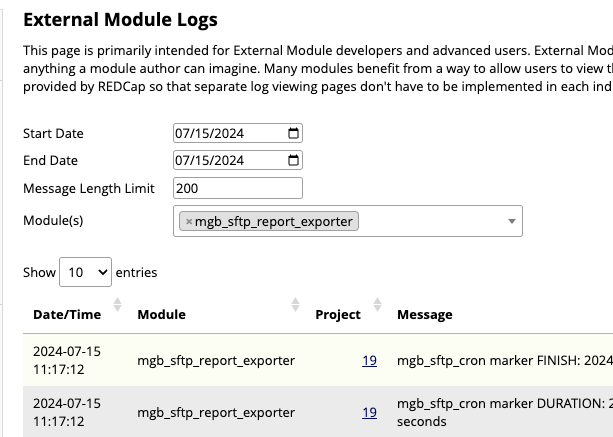
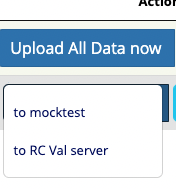
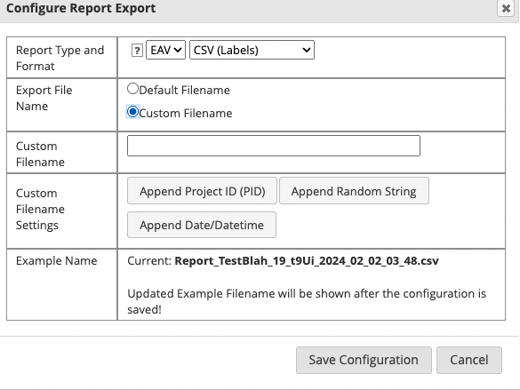

# SFTP Report Exporter - REDCap External Module

An external module to export reports from a REDCap project and deliver them via SFTP to another location. It also supports delivering reports to S3 bucket and to local storage.

## General Configuration and usage

This EM can be configured on the project-level

********************************************************************************

## Version

Version 2.5.15

********************************************************************************

## Introduction

The module facilitates sending project reports to an SFTP destination on a regular schedule.

********************************************************************************

## Deployment

Regular external module enable and configuration.

********************************************************************************

## Getting Started

1. Activate : EM in your project.

2. Configure: Setup SFTP Report Exporter

3. Schedule : Upload report to SFTP

********************************************************************************

## Overview

* Usage and Control
    1. Menus and access of features
    1. Control Center: Set up configuration
    1. Control Center: Listings
    1. Project Setup: Configuration
    1. Project Setup: Usage
        - Sending a Report
        - Cron like options and report type settings
    1. Logs
        - EM Logs
        - Project Logs
        - Keywords and Logs
    1. Authors, License, Acknowledgments
    1. Release notes

********************************************************************************

# Menus and access of features

# * * * * * START HERE * * * * *

### Project side menus

* The **TWO main places you will go are here**:

* START HERE
    - Setup SFTP Report Exporter
        - This is where to specify places to send to, including the directory path on the recieving end.
        - Use this to set up the Connections needed
    - Upload report to SFTP
        - This is where, under a specific report, you set the reports time to send and format.
        - This gives you a list of reports which can be set to upload given the parameters
        - You can: Configure, Upload, Schedule
        - **VERY IMPORTANT NOTE: the reports, the permissions on the report, MUST HAVE, User Access, as All users.**
            - The report may not show up in the listings if the permission is not All users. 

### Control Center left side menu

* SIDE MENU under EMs

* Control Center Listing
    - EM: SFTP Report Exporter
        - Provides a listing of Projects using the SFTP Exporter
        - Can manually start scheduled uploads
    - EM: SFTP MANUAL RUN
        - This will trigger the CRON processing cycle.
    - EM: SFTP SHOW CRON ID
        - Display the External Module ID
            - Useful if you look up in the data tables

# Control Center: Set up configuration

### Setting Control Center EM config options: Test only do not send file, debugging text.

* Debug Cron SFTP Send
    - Checking this will prevent sending via SFTP, and will simulate the send, but not actually send.
    - useful to test and check the overall system process, but not commit to sending a file out.

* Debug Cron ( show debugging text )
    - can give some insight to the process if there are issues with the overall system.
    
    

# Control Center: Listings

### Control Center listing ( from SFTP Report Exporter menu )

* Will show all the projects using the CRON and can initiate a manual run to push reports.

# Project Setup: Configuration

### Project SFTP Set up configuration

* You get to this configuration from: Setup SFTP Report Exporter
    - NAME: some name that describes and expresses who and where the SFTP target resides.
    - HOST: the host name, without the preceding **http://** that belongs to the target site.
    - PORT: usually 22.
    - USERNAME: the SFTP username on the target.
    - AUTH METHOD: using either PASSWORD or KEYS
        - an input field opens for PASSWORD
        - an input box opens to paste the PUBLIC KEY.
    - when done, select the ADD NEW SFTP CONFIG.
    - Similar appropriate fields for **AWS S3** connection and **LOCAL STORAGE**.

##### Configure a target site

* SFTP Name
    - make a name for this site config

* SFTP Host
    - the host site name, without https://, for the sftp destination .

* SFTP Port
    - the port, typically, 22, however make sure you have the correct number of the destination port.

* Username
    - the username for the sftp host destination.

* Authentication method
    - two options here, password or keys.
        1. With Username and Password
        2. With Username and public/private keys

### Existing Configs listing

* Lists out the configurations that are set up for target hosts.

### Existing Configs listing: Name, Host, Port, User, Auth method ( password or x ), other actions.

### Other actions: set target folder, delete entry.

* Set Target Folder
    - and SFTP target host, could have specified directory folders where the hose would prefer files are delivered.
    - here you may discover and select the directory available

* Delete entry
    - the removal of a host destination set up.
    

# Project Setup: Usage

### Project report configuration: Configure, Upload ( dropdown listing destinations ), Schedule ( also dropdown listing destinations )

* Click the action buttons, select from dropdown.
    - clicking the button **does not initiate a transfer immediately**, it gives you a dropdown menu to then use to configure.
    - selecting the button gives a dropdown listing of the destinations available.
    - choosing the item in the dropdown, will either, initiate the transfer or open the configuration for the given destination.
    - Upload ALL Data or Upload report now, give a list of destinations, choosing a destination from the list, will send the report, immediately.  Given time to run the report, to then send.

### Schedule config settings

* Schedule config button
    - Use the **Schedule Upload** to **select the SFTP site** and **configure the settings** for that site.

## Sending a Report

### Upload reports

* Upload button
    - Use **Upload report now** to access a dropdown and **select the SFTP site** to send to, which **will begin the report transfer**.
    - When the report send is complete, a message stating **Upload Complete OK!** will appear.
    - Also there will be a log entry in the project logging showing date time and other info confirming the send has completed.

* Upload ALL button
    - The generic ALL Data report
    - Use **Upload All Data now** to access a dropdown and **select the SFTP site** to send to, which **will begin the report transfer**.
    - When the report send is complete, a message stating **Upload Complete OK!** will appear.
    - Also there will be a log entry in the project logging showing date time and other info confirming the send has completed.

********************************************************************************

## Cron like options and report type settings

### Settings: Frequency, Format, Enabling Disabling, Last Send Status

* Setting options: Frequency, Format, Enable Disable
    - Frequency: Daily, Weekly, Monthly
        - Daily: Once per day, Every hour, Every 6 hours, Every 12 hours
        - Daily and Once per day: choose an hour, granular by hour.
        - Weekly: select day of week, or days of week. Also select hour.
    - Format: Type, Data, OR, Defined Configuration
        - Type: Flat or EAV
        - Data: CSV Raw, CSV Labels, ODM XML Raw, ODM XML Labels, JSON Raw, JSON Labels
        - OR Defined Configuration
    - Export Types
        - Flat - output as one record per row [default]
        - EAV - output as one data point per row
            - Non-longitudinal: Will have the fields - record*, field_name, value
            - Longitudinal: Will have the fields - record*, field_name, value, redcap_event_name
            - **record** refers to the record ID for the project
            - **If your report does not include the RECORD ID as one of the fields, then EAV format cannot be produced!**

### Type: Flat, EAV

* Format: Type

### Format: CSV, XML, JSON, Raw and Labels

* Format: Data

### Frequency: Daily, Weekly, Monthly

* Frequency selection

### Frequency Daily: Once, Every hour, Every six hours, Every twelve hours

* Frequency Daily selection

### Frequency Daily: Select hourly type

### Frequency Daily Every hour

* Frequency Daily choose Hourly

### Frequency Daily choose hour

* Frequency Daily choose Hour

### Frequency Weekly and choose Day of week

* Frequency Weekly and Day of week

### Use of Configure and Format configuration

* Format: choose **Configure** to set a specific configuration

### Configuration options

### Configuration options: Filename customization

* Filename: set up the resulting filename also which will be filename that the destination will be given.

### Configuration options: Export types Flat EAV

# Logs

## EM Logs

### External Module logs

### Simulation test message in EM log

## Project EM Logs and Control Center EM Logs

### Logs

* Project and System EM Logs can be used to observe activity and diagnose potential issues.

### Keywords and Logs

* Log key word entries to monitor for diagnosing issues
    - COMPLETE or RESULT UPLOAD COMPLETE
    - File Size
    - DURATION, START, FINISH
    - HOURLY RUN 
    - UPLOAD SEND SFTP
    - TEST UPLOAD SEND SFTP
        - feature in EM configuration to bypass the actual file send SFTP communication to aid diagnosing process issues.
        - see setting: debug_test_send
        - see example log: Simulation test message

********************************************************************************

********************************************************************************

********************************************************************************
********************************************************************************
********************************************************************************

# SFTP and Custom file naming and other settings

*********************

* Additional features of filename embellishment, setting of timing when to send file and other options.

# Button uploading

## uploadbutton 

* Upload ALL Data now will use the built in report sending all data.

# Button custom configuration

## configbuttons

* Using the Configure button will allow custom configuration setup of type, format and filename.  Filename customization allows embellishments of the file name with date and time stamping, project ID, and a random string.

# Custom Config File Name

## configdate

## configdatetime

## configpid

## configpiddate

## configreport

# Format

## flatoreav

## configflateav

## configformat

## configtype

*********************

# FREQUENCY

## configfrequency

# DAILY

## configdaily

# HOURLY

## confighourly

# Other Hour Increments

# WEEKLY

# MONTHLY

## configmonthly

## configmonthlyselectday

## configmonthlyselectdayhour

## configmonthlydayhourset

*********************

*********************

*********************

## configselecthour

## configcustomname

## configweekly

## configweeklyandhour

## settingglobaloptions

## settingglobalsendisoff

## sftpemlisted

********************************************************************************
## Authors

* **Dimitar Dimitrov** - *Initial work and ALL the work* 
    - Dimitar Dimitrov
    - edcsupport@partners.org
    - Mass General Brigham

* **David Heskett** - *later contributions and additional features, logging enhancements, documentation* 
    - dheskett@mgb.org

## License

This project is licensed under the MIT License - see the [LICENSE](?prefix=mgb_sftp_report_exporter&page=LICENSE.md) file for details

## Acknowledgments

* Inspired by MGB RISC REDCap Team. Lynn Simpson, Dimitar S. Dimitrov, Eduardo Morales, David Clark

********************************************************************************

## Release notes

## Version 2.5.16
Changes for REDCap Scan identified issues. Couple of logging fixes.

## Version 2.5.15
Documentation update.

## Version 2.5.14
Fix remote file size handling by adding to return instead of object property.  Also change revision order history to newest to oldest. Fix some javascript message handling and some exception handling.

## Version 2.5.12 
File Size logging added for local and remote. And bumps modification time on the temp file.

## Version 2.5.11
Add cron manual trigger feature.

## Version 2.5.10
Fix oversight bug of passing a flag to a function. And improves the flagging logic. Update vendor files for phpseclib.

## Version 2.5.9
Adding detailed logging for more informative steps of process handling.

## Version 2.5.8
Adjustment to remedy midnight and early AM crossover.

## Version 2.5.7
Adjustment to the check for every hour timer to remedy skipped hourly times. Added some logging messages.

## Version 2.5.6
Add check for strlen when retrieve the report to display putting in fix from 2.5.4 that was missed. Also remove a test stub.

## Version 2.5.5
Adjustment to every hour timer to remedy skipped hourly times.

## Version 2.5.4
PHP 8 fix - issue array keys of -1 and javascript call with an unused param.

## Version 2.5.3
PHP 8 fix - issue with non static method being called statically.

## Version 2.5.2
PHP 8 fix - issue with abs function and strings needing typecast to int.

## Version 2.5.1
Bug fix - the report configuration overlay window would mistakenly not load

Added additional logging option for CRON jobs. Reports will be stored in the External Modules logging screen; This can be enabled/disabled with a toggle button in the Control Center -> EM: sFTP Report Exporter screen 

## Version 2.5.0
Adding the ability to specify file naming patter on the export file; Allowing for files on the remote storage to be overwritten; Storing the file naming convention and allowing it to be used in the CRON job schedule as well.

## Version 2.0.1
Introduction of a ControlCenter screen and moving the Manually Trigger CRON button to the control center; fix for the duplicate cron jobs; run report at scheduled hour/time

## Version 2.0.0
Adding CRON component to this - a way of automating the distribution of reports on a scheduled basis

## Version 1.5.x
Removed local AWS library dependency as that was clashing with the REDCap one; Using just the REDCap - Libraries AWS library. This is better in the long-run anyways.
Modified the file export name to align more closely with the REDCap Report export naming convention
Adding All Data report as a default available option

## Version 1.4.0
Minor bug fix - removed some debugging code

## Version 1.3.0
Added the ability to export to S3 as well as SFTP; Also added the ability to export to a local folder that is outside of the webroot (recommended) ! And ability to upload to a specific SFTP remote location/folder.

## Version 1.2.0
Adding the ability to export in EAV format as well as RAW vs Labels export. Updates to the export formats.

## Version 1.1.0
Improvements to the security of the credential storage - scrambling data at-rest and tying it to the project so that if the project is copied WITH EM settings, then the password for the SFTP and S3, etc will NOT work on the new project. This is a security design feature.

## Version 1.0.0
Initial development of the module. 

********************************************************************************

********************************************************************************

Developed and tested against REDCap version 14.0.x with PHP 8.1+

### The module has external library dependencies.

* phpseclib - PHP Secure Communications Library

* DataTables 1.11.3

* jsTree 3.3.12

* ParagonIE - Constant-Time Encoding   

********************************************************************************
